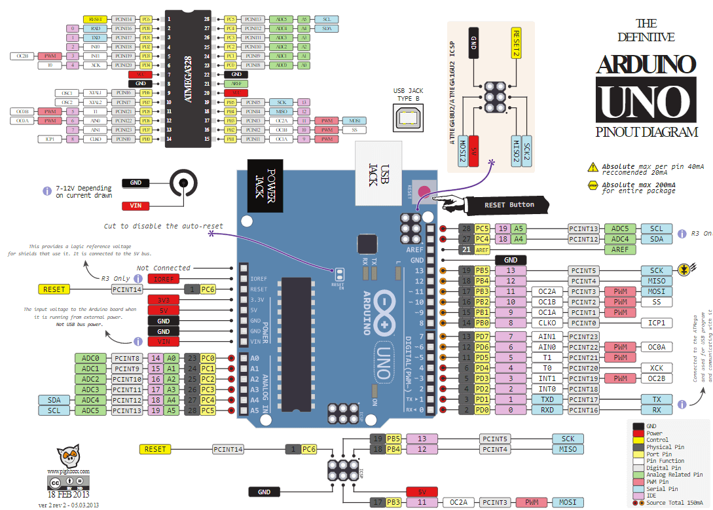

### Arduino已使用引脚定义

---

#### 引脚分布图

---

#### 已使用的数字引脚定义

1. **步进电机4相电源**

- LA = PIN_3
- LB = PIN_4
- LC = PIN_5
- LD = PIN_6

2. **ESP8266**

- PIN_7
- PIN_RX
- PIN_TX

3. **重启相关**

- 给RES电平=PIN_2 
- 重启=PIN_RES